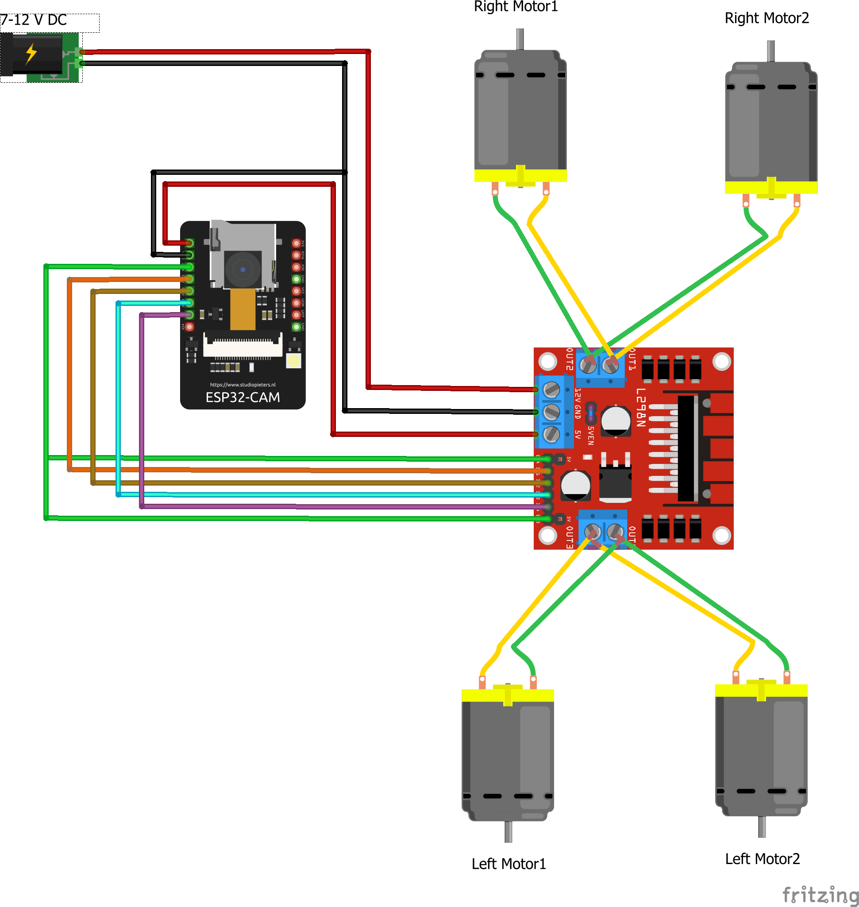
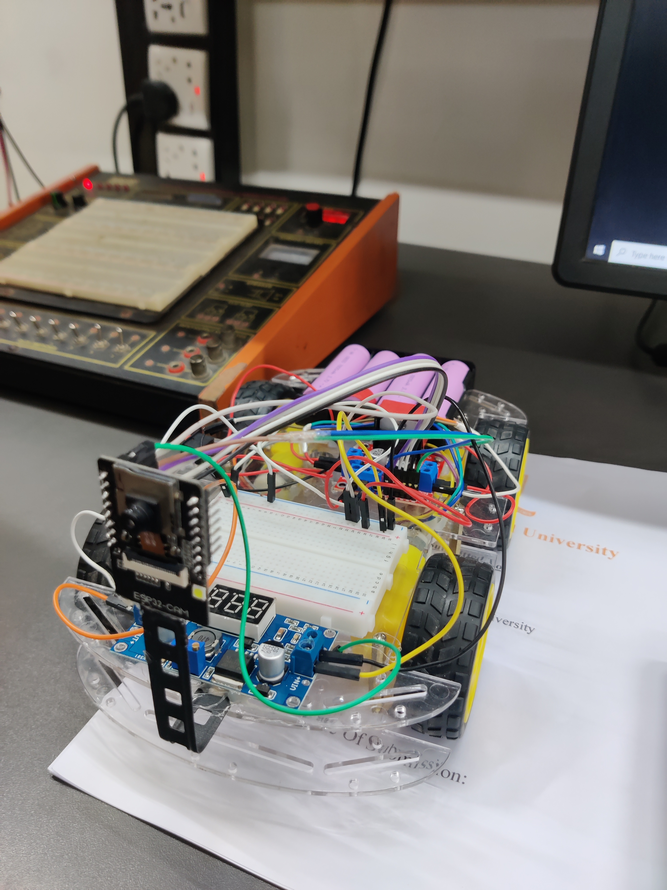

# 🚗🔭 ESP32-CAM Surveillance Car

**A smart robot car with live video streaming — powered by ESP32-CAM!**  
Monitor your surroundings remotely in real-time through an easy-to-use web interface. Perfect for DIY home security, spying missions, or just tech fun! 😎

---

## ✨ Features

- 🎥 **Live video streaming** straight from the ESP32-CAM camera  
- 🌐 Control & monitor your car **via any web browser** — no extra apps needed  
- ⚙️ Simple, lightweight design — *no pan-tilt*, just raw power and smooth streaming  
- 🔋 Battery-powered for full mobility

---

## 🔧 Hardware Components

- ESP32-CAM module  
- Robot car chassis with motors & wheels  
- Motor driver module (e.g., L298N)  
- Battery pack & wiring

---

## 💻 Software Stack

- Arduino IDE firmware  
- WebSocket / HTTP server running on ESP32 for streaming & control  
- Sleek HTML/CSS/JavaScript web interface  

---

## 🛠️ Diagram

  
---

## 📸 Pictures

  
  

---

## 🎬 Videos

*Click on the image to watch the video of this project :)*

---

## 🚀 How to Run

1. Flash the ESP32-CAM with the provided code.  
2. Configure your Wi-Fi SSID & password inside the code.  
3. Power up the robot car and connect it to your network.  
4. Open your favorite browser and enter the ESP32’s IP address.  
5. Enjoy live streaming & remote control of your surveillance car! 🕹️

---

## 🤝 Contributions & Feedback

Feel free to open issues or submit pull requests! Let’s make this project even cooler together. 💪

---
## 🙌 Credits

This project was done by **[Ahnaf Tahmid](https://github.com/iamahnaf)** and **[Mostakim Khan](https://github.com/khanpsyco)**.

Thanks for the teamwork and collaboration! 🤝

## 🔗 Connect

Got questions? Reach out or check my other projects!
